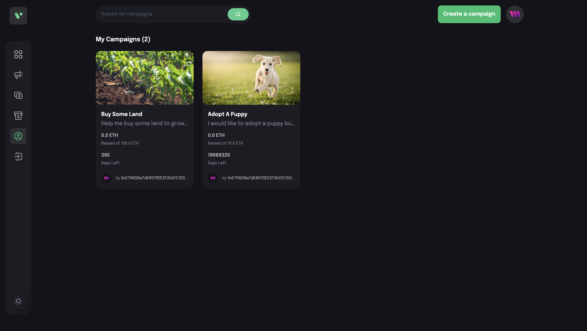

# Crypto Fund Me

Crypto Fund Me is a frontend application built with React for creating and managing crowdfunding campaigns on the Ethereum blockchain. It allows campaign creators to receive donations in either ETH or specific ERC20 tokens and provides features to manage campaigns effectively.

## Usage

Home Page

Create Campaign Page

Profile Page

**Contract Address (Sepolia)**: 0xcB12466e687a29DAF18926f35042384fdB81Da35

## Features
**Campaign Creation**: Users can create campaigns for fundraising, specifying details such as the title, description, target amount, deadline, and an image.

**ETH and ERC20 Support**: The contract supports campaigns that accept either ETH or a specified ERC20 token as donations.

**Donation Fees**: A fee is deducted from each donation, with the rate set in the contract, and is sent to a specified fee recipient address.

**Campaign and Donation Tracking**: Stores and retrieves campaign details and donations, allowing for transparent tracking of funds raised.