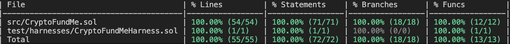

# CryptoFundMe

CryptoFundMe is a smart contract for creating and managing crowdfunding campaigns on the Ethereum blockchain. It allows campaign creators to receive donations in either ETH or specific ERC20 tokens and provides features to manage campaigns effectively.

**Contract Address (Sepolia)**: 0xcB12466e687a29DAF18926f35042384fdB81Da35

## Features
**Campaign Creation**: Users can create campaigns for fundraising, specifying details such as the title, description, target amount, deadline, and an image.

**ETH and ERC20 Support**: The contract supports campaigns that accept either ETH or a specified ERC20 token as donations.

**Safe Donation Handling**: Utilizes OpenZeppelin's SafeERC20 library to securely handle ERC20 token transfers, helping to prevent common issues with token transfers.

**Fixed-Point Arithmetic**: Integrates with prb-math library's UD60x18 type for precise fixed-point arithmetic, ensuring that calculations are accurate and overflow-safe.

**Custom Events**: Emits events for key actions, including campaign creation, donations, and administrative changes like deadline and target amount adjustments.

**Change Fees**: Campaign creators can change the deadline or target amount of their campaign by paying a change fee.

**D*onation Fees**: A fee is deducted from each donation, with the rate set in the contract, and is sent to a specified fee recipient address.

**Owner Privileges**: The contract owner can set the change fee, designate the fee recipient, and remove campaigns.

**Modifiers for Validation**: Includes modifiers to ensure that campaigns are active, the sender is the campaign creator, and the sender is the contract owner for respective functions.

**Campaign and Donation Tracking**: Stores and retrieves campaign details and donations, allowing for transparent tracking of funds raised.

**Error Handling**: Custom errors are defined for various failure cases, such as ended campaigns, goal reached, unauthorized actions, and failed transactions.

## Testing

This test suite features 100% line, statement, branch and function coverage.

Result from `forge coverage`:

To run the Foundry test suite, run:

`forge test`